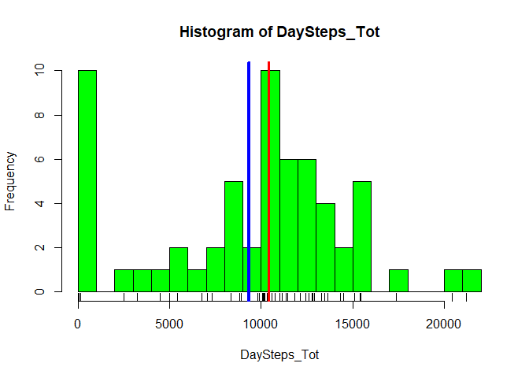
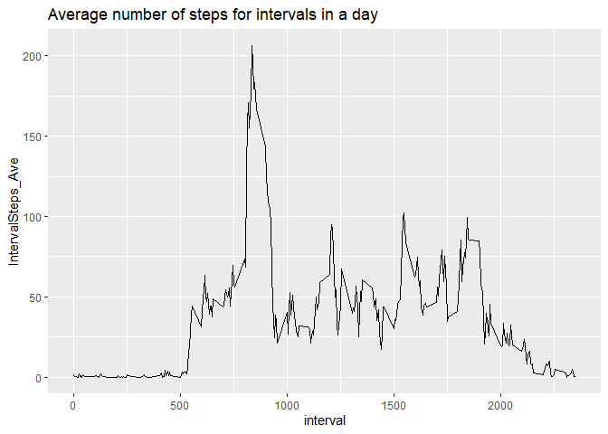
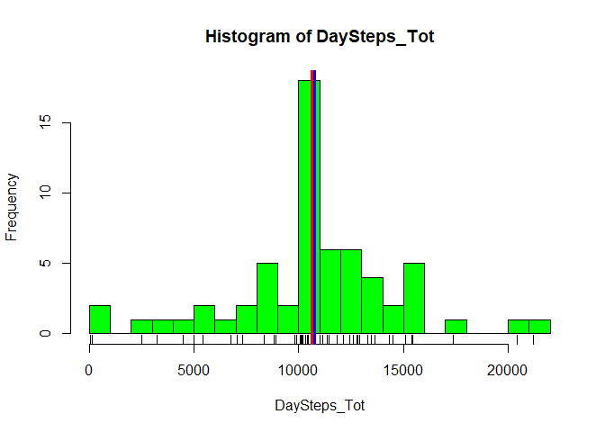
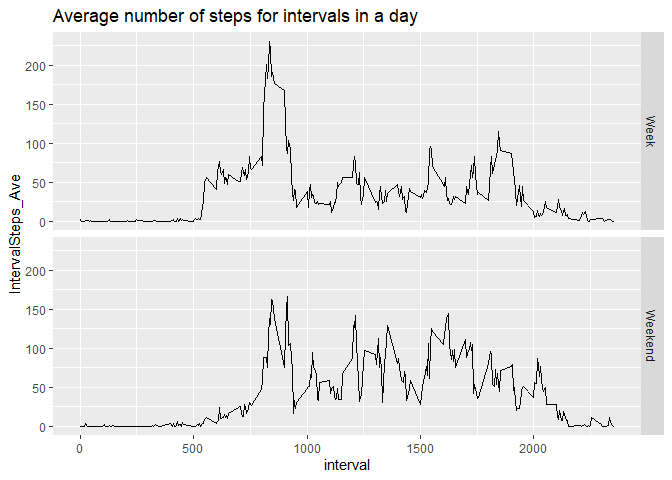

```r
library(knitr)
library(dplyr)
```

```
## 
## Attaching package: 'dplyr'
```

```
## The following objects are masked from 'package:stats':
## 
##     filter, lag
```

```
## The following objects are masked from 'package:base':
## 
##     intersect, setdiff, setequal, union
```

```r
library(ggplot2)
library(lattice)
opts_chunk$set(echo=TRUE,results="asis")
```

## Loading and preprocessing the data

```r
unzip(zipfile ='./activity.zip')
act_all<-read.csv("activity.csv")
dateDownloaded<-date()
```

## What is mean total number of steps taken per day without NAs

```r
act_totals_woNA<-act_all%>%select(date,steps)%>%group_by (date)%>%summarise(DaySteps_Tot=sum(steps,na.rm=TRUE),DaySteps_Mean=mean(steps,na.rm=TRUE),DaySteps_Median=median(steps,na.rm=TRUE))%>%as.data.frame()
```

### Histogram of the total number of steps taken each day

```r
with(act_totals_woNA,hist(DaySteps_Tot,col="green",breaks=30))
rug(act_totals_woNA$DaySteps_Tot)
abline(v=mean(act_totals_woNA$DaySteps_Tot),col="blue",lwd=4)
abline(v=median(act_totals_woNA$DaySteps_Tot),col="red",lwd=3)
```

<!-- -->

### Calculate and report the **mean** and **median** total number of steps taken per day

```r
meanTotsteps<-round(mean(act_totals_woNA$DaySteps_Tot),2)
medianTotsteps<-round(median(act_totals_woNA$DaySteps_Tot),2)
```
The **mean total number of steps**, namely 9354.23 is the blue vertical line on histogram  
The **median total number of steps**, namely 10395.00 is the red vertical line on histogram  

## What is the average daily activity pattern?


```r
act_intAve_woNA<-act_all%>%select(interval,steps)%>%group_by (interval)%>%summarise(IntervalSteps_Tot=sum(steps,na.rm=TRUE),IntervalSteps_Ave=mean(steps,na.rm=TRUE))%>%arrange(desc(IntervalSteps_Ave))%>% as.data.frame()
MaxAveSteps_interval<-act_intAve_woNA$interval[act_intAve_woNA$IntervalSteps_Ave==max(act_intAve_woNA$IntervalSteps_Ave)]
g1<-ggplot(act_intAve_woNA,aes(interval,IntervalSteps_Ave,group=1))
g1+geom_line() +labs(title="Average number of steps for intervals in a day")
```

<!-- -->
  
The 5-minute interval that contains the maximum number of steps, on average across all the days in the data set is at 835.


## Imputing missing values

```r
RowsStepNA<-sum(is.na(act_all$steps))
```
The total number of rows with NAs in the step column is 2304.

### Imputing strategy:  
The missing values will be imputed with the mean for that 5-minute interval

### Create a new dataset  with the missing data filled in:

```r
Imputestepvals<-act_all%>%select(interval,steps)%>%group_by (interval)%>%summarise(IntervalSteps_Ave=floor(mean(steps,na.rm=TRUE)))%>% arrange(interval)%>%as.data.frame()
actMerge<-merge(act_all,Imputestepvals,by.x="interval",by.y="interval",all=FALSE)
actImputed<-actMerge%>%mutate(steps=ifelse(is.na(steps),IntervalSteps_Ave,steps))%>%select(steps,date,interval)%>%arrange(date,interval)
```

### Histogram of the total number of steps taken each day after imputation

```r
act_totals_imp<-actImputed%>%select(date,steps)%>%group_by (date)%>%summarise(DaySteps_Tot=sum(steps,na.rm=TRUE),DaySteps_Mean=mean(steps,na.rm=TRUE),DaySteps_Median=median(steps,na.rm=TRUE))%>%as.data.frame()
meanTotsteps_imp<-round(mean(act_totals_imp$DaySteps_Tot),2)
medianTotsteps_imp<-round(median(act_totals_imp$DaySteps_Tot),2)

with(act_totals_imp,hist(DaySteps_Tot,col="green",breaks=30))
rug(act_totals_imp$DaySteps_Tot)
abline(v=mean(act_totals_imp$DaySteps_Tot),col="blue",lwd=4)
abline(v=median(act_totals_imp$DaySteps_Tot),col="red",lwd=3)
```

<!-- -->
  
### Calculate and report the **mean** and **median** total number of steps taken per day  
The **mean total number of steps**, namely 10749.77 is the blue line on histogram  
The **median total number of steps**, namely 10641.00 is the red line on histogram  
These values are higher than the estimates from the first part of the assignment  
The estimates of the total daily number of steps increased after imputing missing data  

## Are there differences in activity patterns between weekdays and weekends?
### Add factor variable to indicate week/weekend

```r
actImputed<-transform(actImputed,weekweekend=factor(ifelse(weekdays(as.Date(date,"%Y-%m-%d")) %in% c("Saturday","Sunday"),"Weekend","Week")))
act_intAve_imp<-actImputed%>%select(weekweekend,interval,steps)%>%group_by (weekweekend,interval)%>%summarise(IntervalSteps_Tot=sum(steps,na.rm=TRUE),IntervalSteps_Ave=mean(steps,na.rm=TRUE))%>%arrange(weekweekend,interval)%>% as.data.frame()
```

```
## `summarise()` has grouped output by 'weekweekend'. You can override using the
## `.groups` argument.
```

```r
g4<-ggplot(act_intAve_imp,aes(interval,IntervalSteps_Ave,group=1))
g4+geom_line() + facet_grid(weekweekend~.)+labs(title="Average number of steps for intervals in a day")
```

<!-- -->


